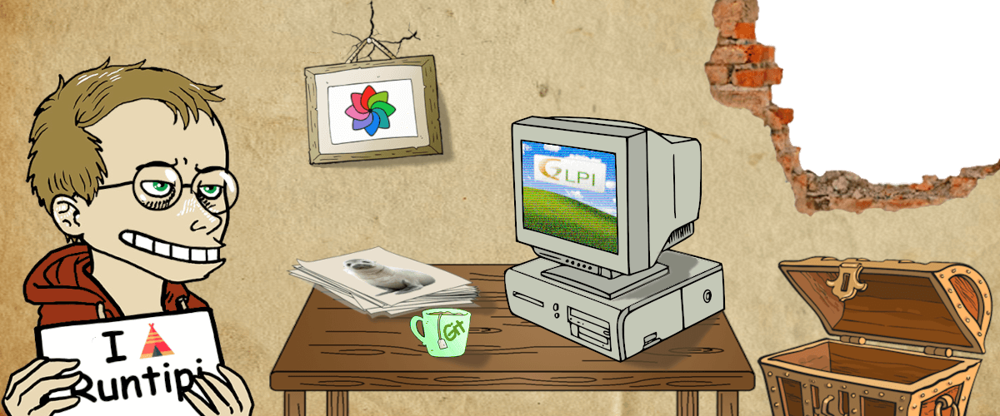

# ⛺ Personal Runtipi Appstore 🏠

This is my self-maintained appstore for [Runtipi](https://runtipi.io) it comes in complement of the [Official one](https://github.com/runtipi/runtipi-appstore) and any other from the community.

All apps here are :

- 🌟 Original
- 😉 Easy to install
- 👷‍♂️ Carefully tested

## Apps available

| Logo                                                         | Name                                                         | Description                                  |
| :----------------------------------------------------------------------: | ------------------------------------------------------------ | -------------------------------------------- |
|        | [Docuseal](https://github.com/docusealco/docuseal)           | Digital document signing and processing      |
|    | [Gitea runner](https://gitea.com/gitea/act_runner)           | Runner for Gitea                             |
|            | [GLPI](https://github.com/glpi-project/glpi)                 | Asset and IT Management Software             |
|      | [Habit Trove](https://github.com/dohsimpson/HabitTrove)      | Gamified habit tracking                      |
|    | [Immich Kiosk](https://github.com/damongolding/immich-kiosk) | Slideshow for Immich                         |

> [!TIP]  
> If you are eager to discover many more apps, I invite you to also try my [Experimental Appstore](https://github.com/Lancelot-Enguerrand/Experimental-Appstore)

### 👨‍💻 How to use ?
> [!WARNING]
> You need a **[Runtipi](https://runtipi.io)** installation.

1. Log into your dashoard

2. Go to **Settings** -> **App Stores**

3. Click on **Add App Store** then copy and paste this in Appstore URL : 
*`https://github.com/Lancelot-Enguerrand/Runtipi-Appstore`*

### 🔧 Help and Support

If you encounter a difficulty or just have a question : [Open an Issue](https://github.com/Lancelot-Enguerrand/Runtipi-Appstore/issues/new)

### 📨 Requests

I won't be able to take any app requests here but I am open to ideas in [my laboratory](https://github.com/Lancelot-Enguerrand/Experimental-Appstore)

### ✨ Credits

- **Apps** : Thanks to the developpers of the listed apps for their open-source work.
- **Runtipi** : Thanks to the maintainers of Runtipi itself, specially to  [@nicotsx](https://github.com/nicotsx) and [@steveiliop56](https://github.com/steveiliop56)
- **Illustration Cover** : Patchworked by myself with GIMP *(AI and piss filter free)*
  - **Avatar** : From the work of [Boulet](https://www.bouletcorp.com) through the [Bouletmaton](https://www.zanorg.net/bouletmaton/)
